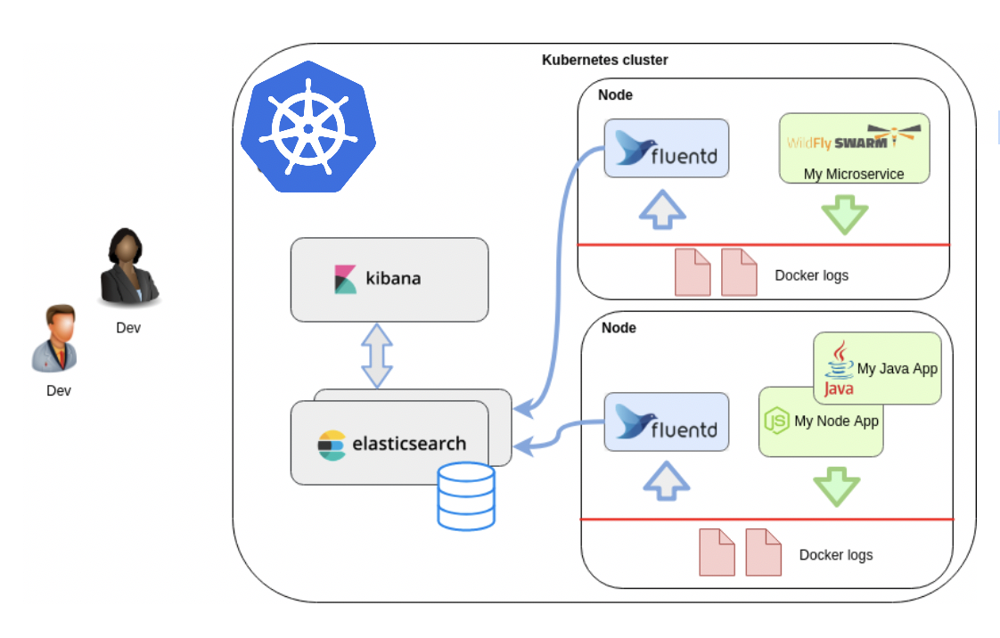
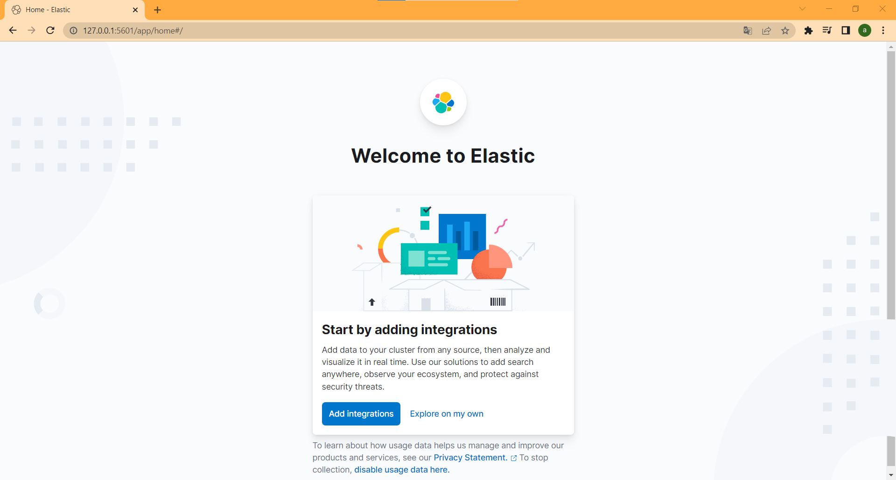
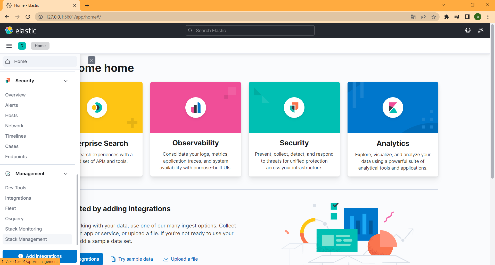
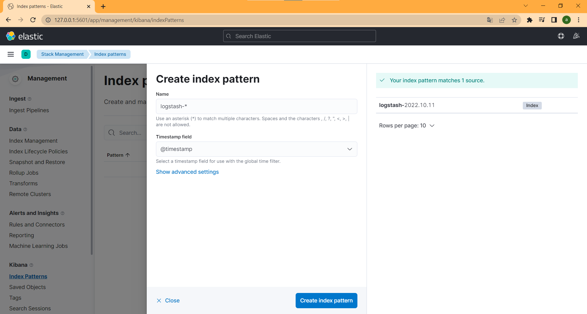
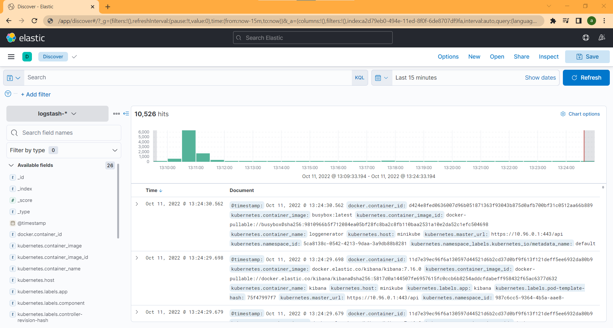

# Elasticksearch Fluentd Kibana Stack  


## Kubernetes Monitoring Servisleri

Birçok uygulamanın birlikte dağıtık bir şekilde çalıştığı mikroservis mimarisinde uygulamarın loglarını manuel olarak takip etmek oldukça zordur ve bu loglarımızı merkezileştirme ihtiyacı ortaya çıkmıştır. 

Elasticsearch bu ihtiyacı karşılamak üzere oluşturulmuş bir monitoring hizmetidir. Elasticsearch containerlar üzerinde bulunan uygulamaların loglarını toplamak için farklı uygulamalar kullanır bunlardan öne çıkanlar fluentd ve logstashtir.



Fluentd her node üzerinde çalışacak şekilde (daemonset) deploy edilir ve containerların oluşturduğu logları toplayıp Elasticsearch'e gönderir. Burada toplanan loglarıda Kibana üzerinden görselleştirebilir ve logların takibini otomatize edebiliriz. 

## Minikube üzerinde EFK Stack Kurulumu


* Minikube 4cpu ve 6144 memory'e sahip olacak şekilde başlatılır.

```
$ minikube start --cpus 4 --memory 6144
```

* Minikube storage addon'ları devreye alınır.

```
$ minikube addons enable default-storageclass
$ minikube addons enable storage-provisioner
```

* Log oluşturacak pod'u çalıştırılır.

```
$ kubectl apply -f testpod.yaml
```

* efk-stack isimli yeni bir namespace oluşturulur.

```
$ kubectl create namespace efk-stack
```

* elastichsearch deploy edilir.
  
```
$ kubectl apply -f elastic.yaml
```


* fluentd deploy edilir.

```
$ kubectl apply -f fluentd.yaml
```

* kibana deploy edilir.

```
$ kubectl apply -f kibana.yaml
```

* Fluentd ve kibana deploymentlarının tamamlandıktan sonra  kibana service'ni expose ederek bağlantı kurulur.
```
kubectl port-forward service/kibana -n efk-stack 5601:5601
```

* Expose ettiğimiz Kibana uygulamamıza web tarayıcımız üzerinden  http://127.0.0.1:5601/  ile erişebiliriz.
  


* Kibana'nın Elasticsearch üzerinden hangi streamden bilgi çekeceğini ayarlamak için Stack Management altında Index Pattern oluşturmamız gerekir.
---


* Kibananın Elasticsearch üzerinden hangi streamden bilgi çekeceğini ayarlamak için Stack Management altında Index Pattern oluşturmamız gerekir. Name ve timestamp alanları aşağıdaki gibi seçilir ve index pattern oluşturulur.

---


* Sonrasında Discover sekmesi üzerinde log kayıtlarımıza ulaşabilir ve sorgularımızı çalıştırabiliriz.

---
